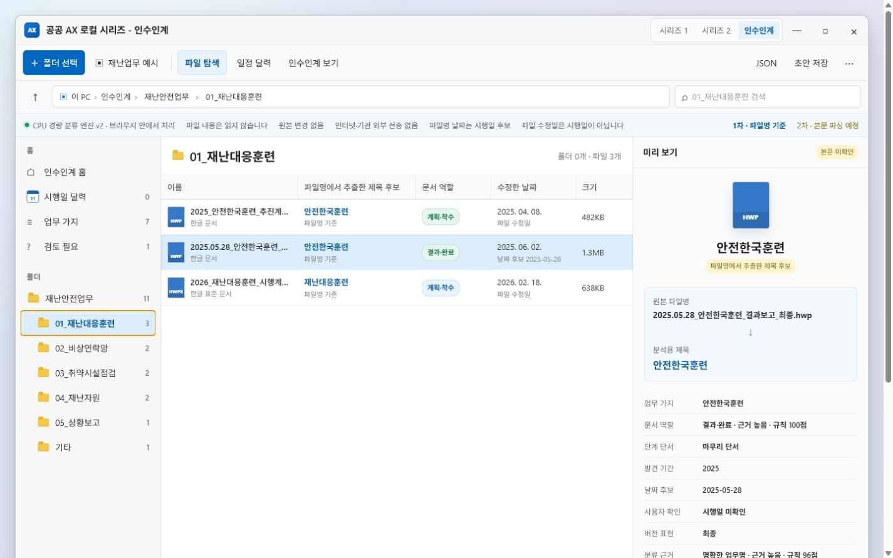
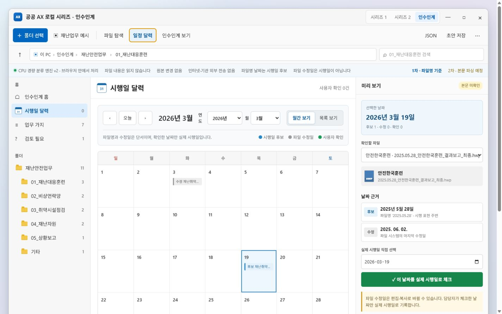
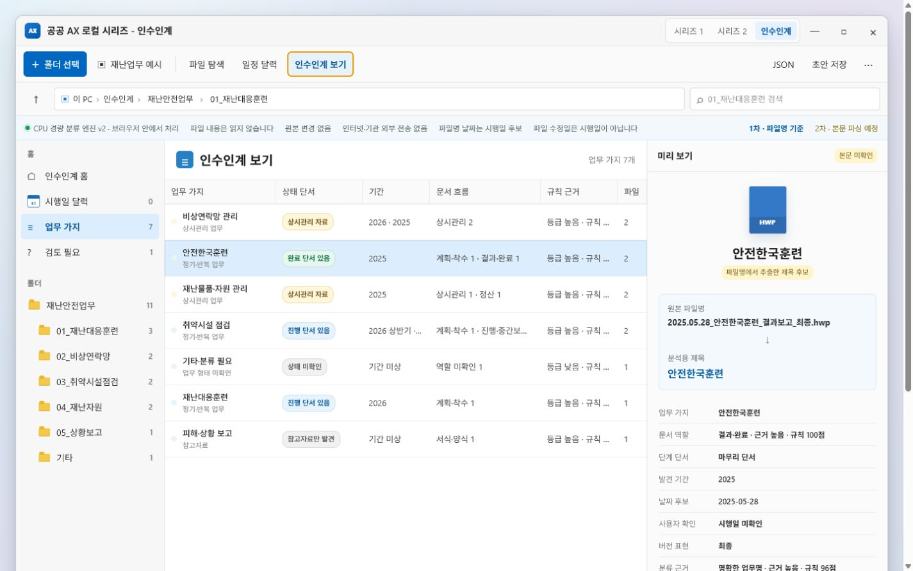

# 공공 AX 로컬 시리즈 - 인수인계 MVP 사용 설명서

[비공개 배포 화면 열기](https://galapagos-public-ai.obun.chatgpt.site/series3)

현재 배포 화면은 소유자 전용입니다. 권한이 없는 GitHub 방문자는
[소스에서 로컬 실행하기](#10-소스에서-로컬-실행하기)를 따라 실행하세요.


위 그림은 전임자의 폴더를 파일명 기준으로 정리하는 흐름을 설명하기 위해 만든
생성형 안내 이미지입니다. 실제 화면의 글자와 배치는 아래 구동 캡처를 기준으로
확인하세요.

## 1. 무엇을 하는 도구인가

전임자가 남긴 업무 폴더에는 하나의 큰 담당 업무 아래 여러 사업, 훈련, 점검,
연락망, 물품 관리 같은 업무 가지가 섞여 있을 수 있습니다. 이 MVP는 문서 본문을
열기 전에 다음 정보만으로 폴더의 전체 흐름을 빠르게 파악하도록 돕습니다.

- 폴더명과 파일명
- 파일 확장자와 크기
- 파일명·폴더명에 적힌 기간과 날짜
- 파일 시스템의 마지막 수정일

파일을 업무 가지로 묶고, 계획·진행·결과·상시관리 같은 역할과 상태 단서를
보여줍니다. 결과는 인수인계 확정본이 아니라 후임자가 원문을 확인하기 위한
`1차 지도`입니다.

## 2. 실제 구동 화면

아래 화면은 생성형 UI가 아니라 배포된 `/series3`에서 내장 `재난업무 예시`를
직접 실행해 캡처했습니다. 개인정보와 실제 기관 문서는 포함하지 않았습니다.

### 파일 탐색과 제목 후보



원본 파일명, 파일명에서 정리한 제목 후보, 계획·결과 같은 문서 역할, 날짜 후보와
수정일을 나란히 확인할 수 있습니다. 오른쪽 미리보기는 문서 내부 제목이 아니라
파일명에서 추출한 분석용 제목입니다.

### 시행일 달력



파란색은 파일명에서 발견한 날짜 후보, 회색은 파일 시스템 수정일, 초록색은
사용자가 실제 시행일로 확인한 날짜입니다. 수정일만으로 업무 시행일을 확정하지
않습니다.

### 인수인계 보기



업무 가지, 정기·상시 같은 업무 형태, 완료·진행·상시관리 단서, 발견 기간,
문서 흐름과 규칙 근거를 표로 확인합니다. `검토 필요` 항목은 근거가 약하거나
표현이 충돌해 사람이 먼저 확인해야 하는 파일입니다.

## 3. 가장 빠르게 체험하기

1. 상단의 `재난업무 예시`를 누릅니다.
2. 왼쪽 폴더 트리에서 `01_재난대응훈련`을 선택합니다.
3. 파일을 눌러 추출 제목, 문서 역할, 날짜 후보와 분류 근거를 확인합니다.
4. `일정 달력`을 눌러 파일명 날짜와 수정일을 비교합니다.
5. `인수인계 보기`에서 7개 업무 가지와 상태 단서를 확인합니다.

예시는 실제 파일을 내려받거나 열지 않고 미리 준비된 파일명 목록만 사용합니다.

## 4. 내 폴더 분석하기

1. `폴더 선택`을 누릅니다.
2. 브라우저의 폴더 선택 창에서 전임자가 남긴 최상위 업무 폴더를 선택합니다.
3. 분석이 끝나면 왼쪽 폴더 트리와 가운데 파일 목록을 확인합니다.

선택한 파일의 내용은 읽지 않고 원본도 변경하지 않습니다. 기본 분류는 브라우저
안의 CPU 경량 규칙 엔진으로 실행되며 외부 분류 API를 호출하지 않습니다.

가능하면 업무 폴더의 원래 구조를 유지한 채 선택하세요. `계획`, `결과`,
`최종본`, `참고자료` 같은 구조용 폴더는 업무명으로 잘못 채택하지 않도록
제외하지만, 구체적인 사업명이나 업무명은 폴더와 파일명에 남아 있어야 분류
근거가 좋아집니다.

## 5. 파일 탐색 결과 읽기

파일을 선택하면 오른쪽 미리보기에서 다음 항목을 확인할 수 있습니다.

- `업무 가지`: 같은 업무로 묶인 파일 그룹
- `문서 역할`: 계획·착수, 진행·중간보고, 결과·완료, 정산, 상시관리 등
- `단계 단서`: 계획 중인지, 진행 중인지, 마무리 자료인지에 대한 파일명 단서
- `발견 기간`: 파일명이나 가까운 폴더에서 찾은 연도·반기·분기
- `날짜 후보`: 파일명 또는 폴더명에서 찾은 정확한 날짜
- `버전 표현`: 최종, 초안, 검토본, 사본 같은 표현
- `규칙 근거`: 왜 그 역할·업무 가지로 분류했는지 보여주는 점수와 등급

점수는 실제 정확도를 백분율로 보증하는 값이 아닙니다. 적용된 규칙 근거의
상대적인 강도를 보여주는 검토용 지표입니다.

## 6. 날짜 후보와 수정일 구분하기

`일정 달력`에서는 연도와 월을 바로 선택하고 `월간 보기` 또는 `목록 보기`로
전환할 수 있습니다.

- `시행일 후보`: 파일명·폴더명에서 발견한 날짜
- `파일 수정일`: 운영체제가 기록한 마지막 수정 시각
- `사용자 확인`: 담당자가 실제 시행일로 체크한 날짜

파일 수정일은 편집, 복사, 파일 이동, 시스템 복원으로 바뀔 수 있습니다.
반드시 문서 내용과 결재·시행 기록을 확인한 뒤 실제 시행일을 체크하세요.

## 7. 실제 시행일 확인하기

1. 달력에서 날짜 후보가 표시된 날짜를 누릅니다.
2. 오른쪽의 `확인할 파일`에서 대상 파일을 선택합니다.
3. 파일명 날짜와 수정일을 비교합니다.
4. 필요한 경우 `실제 시행일 직접 선택`에서 날짜를 고칩니다.
5. `이 날짜를 실제 시행일로 체크`를 누릅니다.

사용자가 체크한 날짜만 확인 정보로 저장됩니다. 현재 MVP는 브라우저를 새로고침하면
체크 상태를 복원하지 않으므로 작업을 마친 뒤 Markdown 또는 JSON을 먼저
내려받으세요.

## 8. 인수인계 결과 검토하고 저장하기

`인수인계 보기`에서 업무 가지별로 다음 내용을 검토합니다.

- 어떤 업무 가지가 발견됐는지
- 최신 업무 주기에 계획·진행·완료 단서가 있는지
- 과거 완료 자료와 새 연도 계획이 함께 있는지
- 사본·백업·수정본 후보가 상태 근거를 부풀리지 않았는지
- 실제 최종본 후보가 여러 개이거나 `최종(안)`처럼 검토가 필요한지

상단의 `초안 저장`은 사람이 읽는 Markdown 인수인계 초안을, `JSON`은 분석 결과와
사용자가 확인한 시행일을 구조화된 데이터로 내려받습니다. 원본 파일은 변경하지
않습니다.

## 9. 선택 기능: Ollama와 Gemma 4 E2B 요약

기본 분류와 인수인계 표는 로컬 AI 없이도 동작합니다. 오른쪽의 `초안 만들기`는
규칙 기반 결과를 문장으로 정리하는 선택 기능입니다.

자동 선택 안전 기준은 다음과 같습니다.

- 로컬 Ollama의 `http://127.0.0.1:11434` 사용
- Gemma 4 E2B
- Ollama가 보고한 Q4 또는 Q5 양자화
- 모델 파일 크기 정보가 있고 8GiB 이하
- 4K 컨텍스트와 짧은 출력 한도 사용
- 생성이 끝나면 모델 메모리 해제

로컬 AI에는 전체 파일 경로와 문서 본문을 보내지 않고, 규칙 엔진이 만든 업무 가지
요약과 제한된 대표 파일명만 전달합니다. 파일이 많아 입력에서 일부 업무 가지가
생략되면 화면과 초안에 그 수를 표시합니다.

AI 초안은 분류 결과를 바꾸지 않으며 완료 여부를 확정하는 기능도 아닙니다.
배포된 HTTPS 화면에서 브라우저 보안 정책이나 Ollama 허용 출처 설정 때문에
localhost 호출이 차단되면 아래 로컬 실행 방법을 사용하세요.

## 10. 소스에서 로컬 실행하기

요구 환경은 Node.js 22.13 이상입니다.

```bash
git clone https://github.com/obundh/gonggong-ax-local.git
cd gonggong-ax-local
npm ci
npm run dev
```

브라우저에서 `http://localhost:3000/series3`을 엽니다. 현재 Windows 포터블 EXE는
Series 2 문서 검수 화면으로 시작하므로 Series 3 사용법에서는 EXE 설치를 안내하지
않습니다.

13세대 i5와 메모리 16GB를 기준으로 분류 엔진과 E2B 설정을 보수적으로 구성했지만,
실제 분석 속도와 Ollama 생성 속도는 파일 수, CPU, 저장장치와 모델 빌드에 따라
달라집니다. 목표 사양 실기 성능 검증은 별도로 진행해야 합니다.

## 11. 한계와 주의사항

- 문서 본문, 결재선, 시행문, 첨부 내용은 읽지 않습니다.
- 폴더명과 파일명이 부정확하면 업무 가지도 부정확할 수 있습니다.
- 완료·진행·상시관리 표시는 파일명 단서이며 실제 업무 상태 확정이 아닙니다.
- `최종`, `완료`, `결과보고`가 있어도 실제 결재·제출·정산 완료 여부는 확인해야
  합니다.
- 파일명 날짜는 후보이고 수정일은 시행일이 아닙니다.
- 사용자가 확인한 날짜와 AI 초안은 저장 파일을 내려받기 전까지 브라우저 임시
  상태입니다.
- 규칙 점수는 검증 데이터로 보정한 정확도 확률이 아닙니다.
- 실제 인수인계 전에는 원문, 결재 시스템, 담당자 메모와 관계자 확인이 필요합니다.

## 12. 문제 해결

- 폴더 선택 창이 열리지 않음: 최신 Chrome 또는 Edge 계열 브라우저에서 다시
  확인합니다.
- 파일이 예상과 다르게 묶임: 업무명이 들어간 가까운 폴더명과 파일명을 확인하고
  `검토 필요` 파일부터 검토합니다.
- 날짜가 다름: 파일명 날짜, 수정일, 실제 시행일을 각각 구분해 확인합니다.
- AI 모델을 찾지 못함: Ollama가 실행 중인지, Gemma 4 E2B Q4/Q5 모델의 크기와
  양자화 정보가 표시되는지 확인합니다.
- 배포 사이트에서 Ollama 연결 실패: `npm run dev`로 로컬 실행하거나 Ollama의
  브라우저 허용 출처 설정을 확인합니다.
