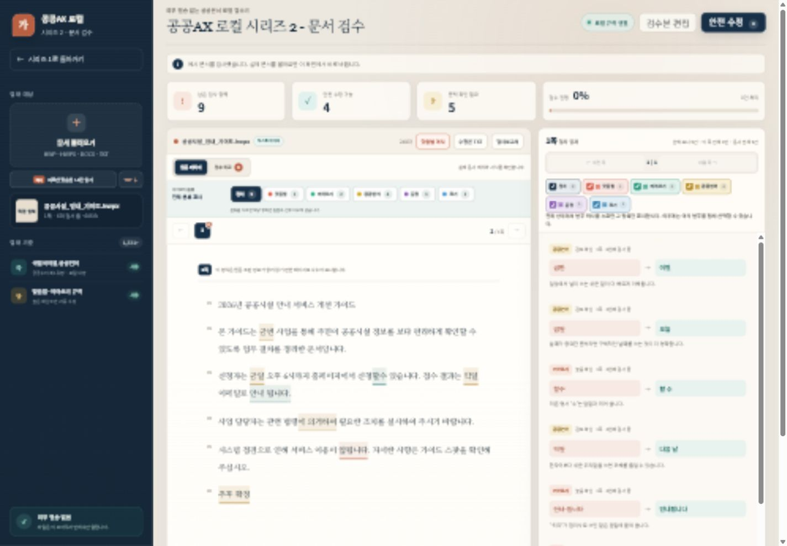
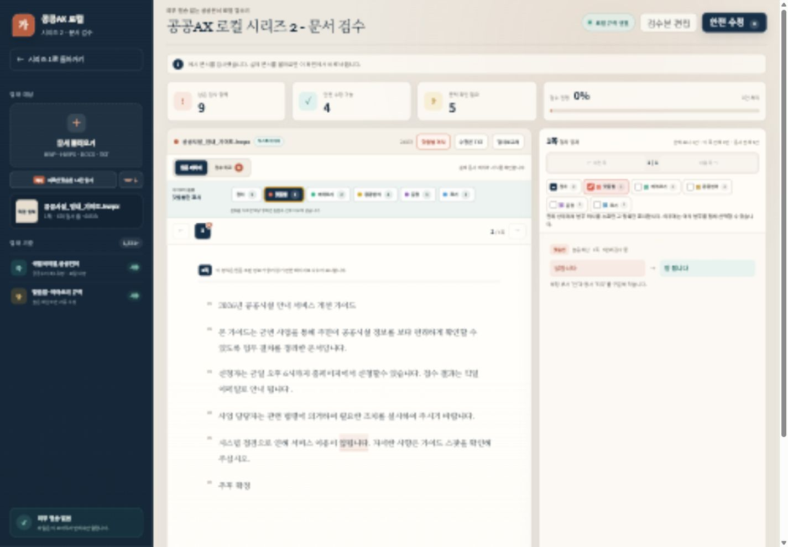

# 공공AX 로컬 시리즈 2 - 문서 검수 사용 설명서

위 이미지는 문서 불러오기, 원문 형광펜, 범주별 검사 결과, 전후 비교의 흐름을
설명하기 위해 생성형 이미지로 제작한 안내 그림입니다. 실제 화면의 글자와 배치는
버전에 따라 다를 수 있습니다.

## 실제 구동 화면

두 이미지는 같은 예시 문서의 실제 실행 화면입니다. 두 번째 화면에서는 `맞춤법`
범주만 선택해 원문 표시와 오른쪽 결과가 1건으로 함께 좁혀진 상태를 확인할 수
있습니다.

## 1. 실행하기

GitHub Releases에서 Windows x64용 EXE 하나를 내려받아 실행합니다. 설치할 필요가
없고, 실행 중 필요한 화면 서버도 프로그램이 PC 안에서 자동으로 시작합니다.
프로그램을 닫으면 로컬 서버도 종료됩니다.

현재 파일은 코드 서명되지 않았습니다. Windows가 게시자 경고를 표시하면
릴리스 페이지에 적힌 파일명과 SHA-256을 먼저 확인하세요.

## 2. 문서 불러오기

왼쪽의 `문서 불러오기`를 누르거나 파일을 끌어 놓습니다. 지원 확장자는
`.hwp`, `.hwpx`, `.docx`, `.txt`입니다. 문서는 브라우저 메모리에서 처리되고
업로드 API로 전송되지 않습니다.

기능을 먼저 확인하려면 `미묘한 맞춤법 10건 열기`를 누릅니다. 맞춤법 오류를
의도적으로 넣은 예시가 즉시 열립니다.

## 3. 원문에서 오류 찾기

가운데 원문 미리보기에서 검수 후보가 형광펜처럼 표시됩니다. 표시 위에 마우스를
올리면 제안, 근거, 원문 위치가 말풍선으로 나타납니다. 쪽 이동 버튼으로 원문의
페이지를 바꿀 수 있습니다.

## 4. 원하는 분류만 보기

검사 결과 위의 `전체`, `맞춤법`, `띄어쓰기`, `공공언어`, `문서 표기`,
`문법·문맥` 범주를 누릅니다. 한 범주만 선택하면 원문 형광펜과 결과 목록이
동시에 그 범주로 좁혀집니다. 다시 다른 범주를 더 누르면 복수 선택할 수 있습니다.

## 5. 수정 검토하기

각 결과에서 제안을 적용하거나 제외할 수 있습니다. `안전 수정`은 기계적으로
판단하기 쉬운 높은 확신도 항목만 일괄 적용합니다. 문맥에 따라 의미가 달라지는
표현은 자동으로 확정하지 않습니다.

전후 비교에서는 최초 원문, 적용한 수정, 아직 남은 제안을 줄별로 비교합니다.
수정 뒤에도 의미와 고유명사, 숫자, 법령·정책 용어를 담당자가 최종 검토하세요.

## 6. 결과 저장하기

수정본은 TXT, 검사 내역은 CSV로 내려받습니다. 불러온 원본 HWP/HWPX/DOCX
파일 자체는 변경하지 않습니다.

## 문제 해결

- HWP가 열리지 않음: 암호·배포용·구형 HWP 여부를 확인합니다.
- 페이지 모양이 다름: 설치되지 않은 글꼴이나 지원되지 않는 개체가 있을 수 있습니다.
- DOCX/TXT 페이지가 원본과 다름: 두 형식은 현재 가상 페이지 미리보기입니다.
- 검사 후보가 너무 많음: 범주를 하나만 선택해 원문과 결과를 함께 좁힙니다.
- 실행 경고가 표시됨: 공식 릴리스 파일의 SHA-256을 확인합니다. 코드 서명은 후속
  배포 단계입니다.
